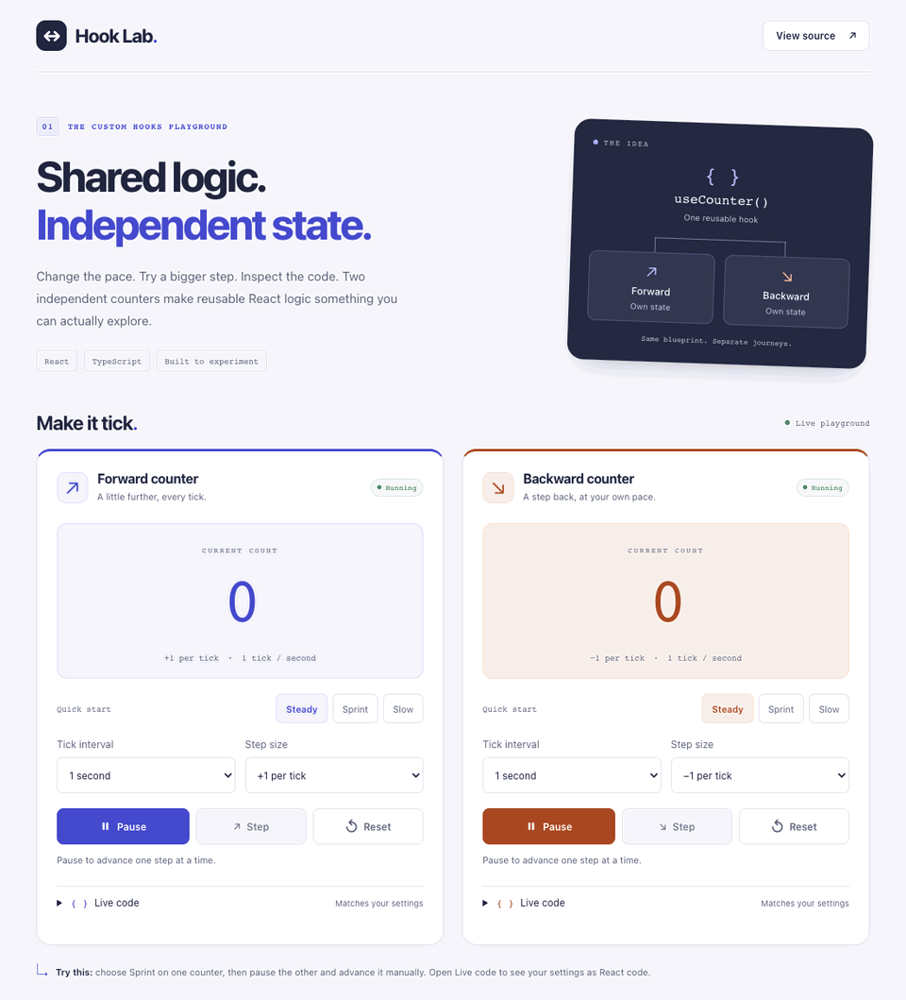

# Hook Lab · React Custom Hooks

[](https://github.com/fatmakahveci/react-ts-custom-hooks/actions/workflows/quality-checks.yml)
[](LICENSE.md)

An interactive playground for understanding custom React hooks, built with TypeScript and Next.js App Router.

**Share the logic. Keep the state independent.** Two counters call the same `useCounter` hook, each with its own direction, timer, and controls. Change one and observe how the other keeps running.

## Demo



A recording of the application demonstrating independent counter controls.

## Features

- **Independent counters:** count forward or backward from zero.
- **Interactive timing:** pause, resume, and choose a 0.5, 1, or 2-second tick interval.
- **Configurable steps:** move by 1, 2, 5, or 10 per tick; advance manually while paused.
- **Quick experiments:** Steady, Sprint, and Slow presets preserve the current count and running state.
- **Live code:** inspect and copy the exact configuration of either counter, with a manual-copy fallback.
- **Guided learning:** three experiments explain independent state, configuration changes, and manual stepping.
- **Fresh starts:** reset either counter to zero, running at the default one-second interval and step size of one.
- **Reusable hook:** typed options and automatic timer cleanup on pause, reconfiguration, and unmount.
- **Responsive interface:** labeled controls, visible keyboard focus, a skip link, and semantic headings.
- **Behavioral tests:** hook lifecycle and user interactions tested with deterministic fake timers.

## Getting Started

### Prerequisites

Use Node.js **22.13 or later within 22.x**, or **24.x**, with npm. The repository's `.nvmrc` selects Node 22; the full accepted version range is declared in `package.json`.

### Installation

```bash
git clone https://github.com/fatmakahveci/react-ts-custom-hooks.git
cd react-ts-custom-hooks
npm ci
npm run dev
```

If you use nvm, run `nvm install` and `nvm use` before installing dependencies.

Open [http://localhost:3000](http://localhost:3000). No environment variables, API keys, database, or external services are needed to run the application.

### Production Build

```bash
npm run build
npm start
```

This starts the built application locally. Choose your own hosting environment for deployment.

## Explore the Playground

1. Watch both counters tick in opposite directions.
2. Pause the forward counter; the backward counter continues.
3. Change the backward counter's interval to **0.5 seconds**.
4. Resume the forward counter; it continues from its previous value.
5. Choose **Sprint** to move by five every half-second.
6. Pause, change **Step size**, and press **Step** to advance exactly once.
7. Open **Live code** to inspect or copy the current configuration.
8. Reset either counter; only that counter returns to its initial settings.

The example beneath the counters shows how both directions use the same hook.

## Using `useCounter`

Call the hook inside a client component or another hook:

```tsx
"use client";

import useCounter from "@/hooks/use-counter";

export default function CounterExample() {
  const forward = useCounter();
  const backward = useCounter(false);
  const fast = useCounter(true, { running: true, intervalMs: 500 });

  return (
    <div>
      <p>Forward: {forward}</p>
      <p>Backward: {backward}</p>
      <p>Fast: {fast}</p>
    </div>
  );
}
```

### API

```ts
useCounter(forwards?: boolean, options?: CounterOptions): number
```

| Parameter | Default | Description |
| --- | --- | --- |
| `forwards` | `true` | Add `1` per tick. Set to `false` to subtract `1`. |
| `options.running` | `true` | Set to `false` to pause while retaining the current count. |
| `options.step` | `1` | Positive safe integer added or subtracted per tick. Invalid values throw `RangeError`. |
| `options.intervalMs` | `1000` | Finite delay between `1` and `2_147_483_647` milliseconds, inclusive. Invalid values throw `RangeError`. |

The returned number starts at `0`. Each hook call owns independent state.

### Timer Behavior

- Changing direction, step size, or interval preserves the count and replaces the active timer.
- Resuming starts a new interval; the next tick occurs after the full delay.
- Pausing or unmounting clears the timer.
- Reset in the demo restores the count, interval, step size, and running state without remounting controls, preserving keyboard focus.

Browser timers can be delayed, particularly in background tabs. The counter measures delivered ticks rather than elapsed wall-clock time.

Counter outputs have accessible labels and disable live announcements so screen readers are not interrupted on every tick.

### Explicit Controls

Use the named `useCounterController` export when a component needs reset or manual stepping:

```tsx
"use client";

import { useCounterController } from "@/hooks/use-counter";

export default function ManualCounter() {
  const { count, tick, reset } = useCounterController(true, {
    running: false,
    intervalMs: 1000,
    step: 5,
  });

  return (
    <div>
      <output aria-label="Manual counter value">{count}</output>
      <button onClick={tick}>Advance by five</button>
      <button onClick={reset}>Reset</button>
    </div>
  );
}
```

`tick()` advances once in the configured direction, including while paused. `reset()` restores zero and restarts a full interval if running; it preserves the hook options. The demo additionally restores its UI settings. Manual stepping in the demo is disabled while running to make each action easy to observe.

The original default export still returns a number, so existing `useCounter()` calls remain valid. Both APIs share one timer implementation. Values use JavaScript numbers and are intended for small interactive experiments, not precision arithmetic beyond the safe-integer range.

## Development Commands

| Command | Purpose |
| --- | --- |
| `npm run dev` | Start the development server. |
| `npm run lint` | Run ESLint with zero warnings allowed. |
| `npm run typecheck` | Generate Next.js route types and check TypeScript. |
| `npm test` | Run the test suite once. |
| `npm run test:watch` | Run tests in watch mode. |
| `npm run build` | Create a production build. |
| `npm start` | Serve an existing production build. |
| `npm run audit` | Check dependencies for high or critical security advisories. |
| `npm run check` | Run lint, type checking, tests, and the production build in sequence. |

Run `npm run check` before submitting changes. GitHub Actions runs the same checks on Node.js 22 and 24 for pushes and pull requests to `main`, with a separate dependency audit.

Tests use Vitest, React Testing Library, and jsdom. They cover direction changes, independent counters, pause/resume, speed changes, reset, invalid delays, interval cleanup, React Strict Mode, keyboard focus after reset, repeated instances, step sizes, presets, controller resets (including at zero), unchanged-option rerenders, paused presets, disabled manual stepping, and clipboard failure or out-of-order completion.

## Project Structure

```text
src/
├── app/
│   ├── globals.css                  Responsive application styles
│   ├── layout.tsx                   Root layout and page metadata
│   └── page.tsx                     Playground and usage explanation
├── components/code/
│   └── code-example.tsx             Copyable code with accessible feedback
├── components/counters/
│   ├── counter.tsx                  Counter state and user actions
│   ├── counter-settings.tsx         Controlled settings and preset fields
│   ├── counter-config.ts            Typed defaults, presets, and options
│   ├── forward-counter.tsx          Forward-counting example
│   └── backward-counter.tsx         Backward-counting example
└── hooks/
    └── use-counter.ts               Timer hook and CounterOptions type
tests/
├── hooks/                          Timer and controller lifecycle tests
└── app/
    ├── page.test.tsx                Interactive page and focus tests
    ├── counter.test.tsx             Presets, stepping, and instance isolation
    └── code-example.test.tsx        Clipboard success and failure tests
.github/
├── workflows/
│   ├── quality-checks.yml           Lint, types, tests, and build
│   └── publish-source-package.yml   Source archive publishing
├── CONTRIBUTING.md                  Contribution guidelines
└── SECURITY.md                      Vulnerability reporting policy
```

The page and direction wrappers compose a shared interactive `Counter` component. The hook manages counting and timer cleanup; the counter component owns UI settings and reset behavior. Controlled settings fields render options from one shared configuration module. Comments document timer resets, focus preservation, and asynchronous clipboard ordering.

## Project Scope

This repository is an educational application with a private npm package configuration. To reuse the hook elsewhere, copy the hook source and adapt its import path to your project.

The source-package workflow publishes an OCI source archive to GitHub Container Registry when triggered by a published release or a manual run. Website deployment is managed separately.

## Contributing

Bug fixes, tests, documentation improvements, and focused enhancements are welcome. Read the [contributing guide](.github/CONTRIBUTING.md) before opening a pull request. See the [changelog](CHANGELOG.md) for recorded changes.

## Security

Report suspected vulnerabilities privately using the process in [SECURITY.md](.github/SECURITY.md). Please keep exploit details and sensitive information out of public issues.

## License

Licensed under the [Apache License 2.0](LICENSE.md).
